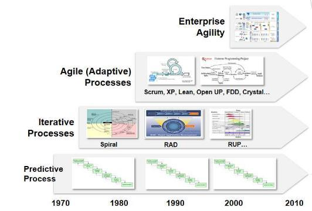
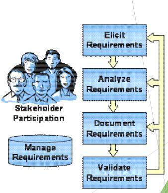

# Requisitos de Software

10/03/2020

email do professor: prof.georgemarsicano@gmail.com

senha do moodle: REQ20.1

## Introdução à Engenharia de Requisitos

---

## Introdução

Dentro de **Engenharia de software** vários modelos definem as etapas necessárias para se construir software, mas, todos têm algo comum: 

Uma etapa dedicada a **compreensão dos problemas** a serem soluciados e a definição de **"o quê"** será feito.

Esta etapa inicial, recebe o nome de **Engenharia de Requisitos**.

## Quando surgiu a engenharia de requisitos?

Em **1993**, a partir da realização da primeira conferência **_IEEE - International Symposium on Requirements Engineering_**, foi criada uma nova área de pesquisa denominada **Engenharia de Requisitos**.

Em **1994**, foi realizada a primeira **_IEEE - International Conference on Requirements Engineering_**

## O que é engenharia de requisitos?

> _"Um conjunto de atividades utilizadas para identificar e comunicar a finalidade de um sistema de software, e o contexto no qual será usado. Assim, a engenharia de requisitos atua como ponte entre as necessidades reais dos usuários, clientes, e outros grupos afetados por um sistema de software, e as potencialidades e oportunidades oferecidas pela tecnologia"_  **(EASTERBOOK, 2004)**

> _"Uma **área multidisciplinar, centrada no ser humano e em seus problemas.** Deve, portanto, investigar como as pessoas **percebem** e **entendem** o mundo ao seu redor, como trabalho afeta suas ações. A engenharia de requisitos deve se utilizar, portanto, das ciências sociais e cognitivas, tais como a filosofia, a psicologia cognitiva, a sociologia e a linguística, dentre outras, para fornecer fundamentos teóricos e técnicas para elicitar e modelar requisitos."_  **(NUSEIBEH, 2000)**

> _"Um processo iterativo, incremental, cognitivo, social, comunicativo e criativo, cujos objetivos são conhecer, entender, estruturar, representar, comunicar e transcrever as informações relevantes de um sistema, extraídas a partir de diferentes segmentos de informação: ambiente da organização; a gerência; e o desenvolvimento."_  **(CARVALHO, 2003)**

## Em que contexto a engenharia de software ocorre?

Geralmente é um sistema de **atividade humana** onde "os donos do problema" são pessoas

_A **obtenção incorreta dos requisitos levará a obtenção e disponibilização de sistemas inadequados** às organizações_  **(ROCHA, 2002)**

A Engenharia de requisitos é utilizada em processos:

- **Preditivos**: O modelo Cascata
- **Iterativo e incremental**: Os modelos Espiral, RAD e RUP (UP em português)
- **Ágeis (adaptativos)**: Crystal, Scrum, XP, FDD, Lean, DSDM, Open UP, Kanbam

> Para o foco desta disciplina, dois tipos de processos serão referenciados
>
> - **Tradicionais**: Preditivos, Iterativos e Incrementais
> - **Ágeis**: Adaptativos.

## Motivações para a Engenharia de Requisitos

Os requisitos especificam o comportamento esperado do sistema na visão do cliente.

A qualidade de um sistema depende necessariamente da qualidade dos requisitos

> Requisitos errados = Sistema errado

Requisistos são utilizados para determinar o prazo e custo dos projetos.

## Engenharia de Requisitos como pilar da Engenharia de Software

A Engenharia de Requisitos é uma disciplina da Engenharia de Software que serve como ponte para diminuir a lacuna entre os requisitos dos usuáriso e a solução de software.

## Atividades da Engenharia de Requisitos

De forma geral, a Engenharia de Requisitos executa as mesmas atividades tanto em processos (metodologias) tradicionais quanto em processos ágeis.

Contudo, a filosofia (tradicional ou ágil) que sustenta essa execução, faz com que tais atividades sejam realizadas de maneira singular.

Desta forma, a Engenharia de Software:

> Estabelece uma **visão comum** entre o cliente e a equipe de projeto em relação aos requisitos que serão atendidos pelo software.

> **Documenta** e **controla** os requisitos alocados para uso gerencial da engenharia de software.

> **Mantém** artefatos e atividades de software consistentes com os requisitos alocados

> **Perpassa** todo o processo de desenvolvimento.

## Por quê Engenharia de Requisitos

Para capturar os requisitos necessários a construção de software de qualidade.

Se não são captudrados bons requisitos:

- Pode ser construído um excelente software para resolver o problema errado
- Perda de tempo e dinheiro
- Frustração pessoal
- Usuários infelizes

## Quem faz a Engenharia de Requisitos

A depender da complexidade do projeto, podemos ter diferentes pessoas como autoras da Engenharia de requisitos, estas podem ser:

- **Engenheiros de software**
- **Analistas de sistemas**
- **Anaslistas de negócios**
- **Especificador de requisitos**
- **Revisor de requisitos**
- **Outros stakeholders**

## Como fazer a Engenharia de requisitos

Os processos variam amplamente dependendo de:

- Domínio da aplicação
- Pessoas envolvidas
- Organização que irá desenvolver os requisitos

Segue imagem que exemplifica as atividades de um processo genérico da Engenharia de Requisitos

## 

# Notas

## Etapas de um processo de software

- Gerência de projeto
- Requisitos

  > A etapa de requisitos gerá subsídios para todas as outras etapas

- Codificação
- Testes
- Gerência de configuração (versionamento)
- Ambiente
- Design

### As metodologias são advindas a partir de necessidades de mercado. Cada software tem um contexto e cada contexto possui metodologias e técnicas que se adequam mais que outras.
