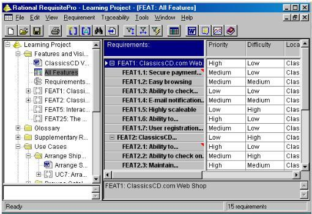
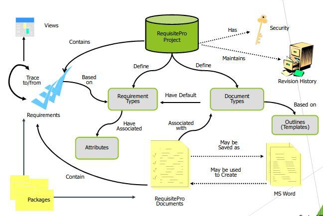

# Requisitos de Software

## O que é um Requisito?

_"Requisitos de um sistema são descrições dos serviços que devem ser fornecidos por esse sistema e as suas restrições operacionais."_  **(SOMMERVILLE, 2007)**

_"Um requisito de um sistema é uma característica do sistema ou a descrição de algo que o sistema é capaz de realizar para atingir seus objetivos."_  **(PFLEEGER, 2004)**

_"Um requisito é algo que o produto dem de fazer ou uma qualidade que este precisa apresentar"_  **(ROBERTSON, 2006)**

Logo, pode-se categorizar um requisito como

1. Uma **condição** ou **necessidade** de um **usuário** para **resolver um problema** ou **alcançar um objetivo**
2. Uma **condição** ou **capacidade** que deve possuir um **sistema** ou componentes de sistemas para satisfazer um **contrato**, **norma**, **especificação** ou outro **documento formal**.
3. Uma **representação** documentada de uma condição, ou capacidade que satisfaça as normas (**_1._**) e (**_2._**)

## Qualidade de Requisitos

A qualidade dos requisitos é um fator fundamental para o sucesso do produto de software a ser construído.

Tanto metodologias tradicionais, quanto as metodologias ágeis prezam pela qualidade dos requisitos

Contudo, o momento da verificação da qualidade dos requisitos pode variar a depender da metodologia que está em vigor para cada projeto.

Existem algumas diretivas que servem de métricas para a medição da qualidade dos requisitos, estas são:

- Ser verificável (testável)
- Ser rastreável
- Ser inteligível
  > As seguintes diretivas são determinadas pela _IEEE - Computer Society_
- Ser correto
- Ser completo
- Ser consistente
- Ser não-ambíguo

### Verificável

Um sistema é verificável se existir algum processo efetivo que demonstre que o software atende aos requisitos documentados.

### Rastreável

Um sistema é rastreável se permite que sua origem seja determinada.

### Correto

Um sistema é correto se os requisitos contém toda a informação necessária, de acordo com as necessidades de cada contexto.

### Completo

Um sistema é completo se a especificação contem todos os requisitos significativos e necessários, tais como:

- funcionalidades
- performance
- restrições
- projetos
- interfaces externas

### Não-ambíguo

Um sistema é não-ambíguo se este possuir uma única interpretação. Esta interpretação deve ser universal e constante entre todos os _stakeholders_ envolvidos diretamente com o projeto.

### Consistente

Um sistema é consistente caso sua especificação (casos de uso, histórias de usuário e especificações suplementares\_ estejam coerentes com as especificações de mais alto nível).

Supletivamente, os requisitos devem apresentar consistência entre si, e em um mesmo nível hierárquico de requisitos, sem que haja conflitos internos.

## O que não é um requisito

### Design

_Mesmo que este demonstre como implementar um requisito:_  
Modelos de design especificam componentes do sistemas e/ou suas interfaces, com seus sub-componentes.

### Verificação

_Mesmo que a verificação demonstre como saber se algum requisito está correto:_  
Modelos de teste especificam casos teste e procedimentos de **testes**.

### Modelagem do banco de dados

_Mesmo que a modelagem demonstre onde e como os requisitos serão armazenados:_  
Modelos de banco de dados definem a estrutura de onde os insumos dos requisitos serão armazenados.

## Abordagens percorridas pelos requisitos

A partir do entendimento do que é um requisito, suas classificações e atributos de qualidade, pode-se começar uma análise a fim de determinar as "**metodologias**" pelos quais os requisitos podem passar

Propõe-se que as metodologias sejam estabelecidas a partir do **contexto organizacional**, das **necessidades dos clientes**, **da equipe de engenharia de software** e, por fim, dos **objetivos** do produto.

> Para clientes mais formais, metodologias **mais** formais

> Para cleitnes menos formais, metodologias **menos** formais

> Para clientes com características híbridas, metodologias **híbridas**

De uma maneira geral, a Engenharia de Requisitos executa as mesmas atividades tanto em metodologias tradicionais, quanto em metodologias ágeis.

Contudo, a filosofia (tradicional ou ágil) que sustenta essa execução, faz com que tais atividades sejam realizadas de maneira singular

## Metodologias da Engenharia de Requisitos

### Modelo Cascata (preditivo)

### Modelo Espiral (iterativo e incremental)

### Processo unificado (_RUP_) (iterativo e incremental)

### Scaled Agile Framework (_S.A.F_) (processo ágil e adaptativo)

#### Portfolio

#### Programa

#### Time

## Atividades da Engenharia de Requisitos

### Elicitação de requisitos

_A elicitação de requisitos pode ser considerada a atividade mais importante do processo de Engenharia de Requisitos._   **(GOGUEN, 1994)**

_Processo cuidadoso de análise da organização, do domínio da aplicação e do processo de negócio, no qual o sistema será utilizado._   **(PRESSMAN, 2002)**

_É um processo de **transferência de conhecimento** do stakeholder para o engenheiro de requisitos._   **(KOTONYA, 1998)**

O processo de elicitação de requisitos requer uma **forte comunicação** entre analistas e stakeholders.

#### Técnicas

- Estudo de documentação
- Análise de contexto
- Observação
- Análise social
- Estudo etnográfico
- Entrevista
- Reunião JAD (Joint Application Development)
- Brainstorming
- Workshop
- Grupo focal
- Questionário
- ...

### Análise e Negociação

Nem tudo aquilo que se quer fazer em termos de software pode ser feito. O analista deve expor os motivos que possam limitar os requisitos e negociá-los msotrando os riscos envolvidos.

_Refinar os requisitos e assegurar-se de que todas as partes interessadas compreendam e estejam atentos para erros e outras deficiências._   **(WIEGERS, 2003)**

### Documentação

_Os requisitos aprovados na atividade de análise e negociação devem ser registrados._   **(KOTONYA, 1998)**

_A especificação do sistema é o produto de trabalho final desenvolvido pelo engenheiro de requisitos._   **(PRESSMAN, 2002)**

_Os modelos gráficos, auxiliam os engenheiros de softwarea entenderem a estrutura do projeto._   **(PRESSMAN, 2002)**

### Verificação e Validação

Esse processo visa antecipar problemas antes que eles passem para as fases seguintes.

> _"A validação de requisitos examina a especificação para garantir que todos os requisitos tenham sido declarados de modo não ambíguo, que as inconsistências, omissões e erros tenham sido detectados e corrigidos e que os produtos de trabalho estejam de acordo com as normas estabelecidas para o processo, projeto e produto."_   **(PRESSMAN, 2002)**

Esta atividade verifica se:

- Os requisitos estão claramente estabelecidos
- Os requisitos podem ser mal interpretados
- A fonte dos requisitos está identificada
- O requisito está limitado em termos quantitativos
- Pode-se rastrear os requisitos em qualquer modelo criado do sistema
- O requisito viola alguma restrição de domínio
- Outros requisitos se relacionam com esse requisito

#### Verificação

A verificação é o processo que confirma se o produto está sendo construindo de **maneira correta**.

#### Validação

A validação é o processo que confirma se o time está construindo o **projeto certo**.
software

### Gerência de requisitos

_"Essa atividade possui como objetivo administrar os requisitos ao longo do projeto de software."_   **(PRESSMAN, 2002)**

Mantém a sincronia entre os requisitos e as demais atividades do processo de desenvolvimento.

Avalia os impactos e riscos envolvidos nas mudanças

#### Princípios

- Gerenciar as mudanças, para o aceite dos requisitos
- Gerenciar o relacionamento entre os requisitos
- Gerenciar as dependências entre o documento de requisitos e outros documentos produzidos durante o proceso de Engenharia de Software.

## Identificação e Armazenagem

Os requisitos devem ser guardados e devem ter um identificador único (chave)

Além da chave deve possuir uma identificação simbólica. Como FEAT1, FEAT2.

O desejável é que os requisitos sejam aramzenados com as seguintes facilidades:

- Informações sobre as dependências de requisitos
- Capacidade de busca
- Controle de versões
- Relacionamento dos requisitos e suas representações visuais

## Gerência de Mudança

A informalidade é a maior problemática dentro do especto da gerência de mudança

Estatísticas mostram que 80% das mudanças nos requisitos são feitas na informalidade

O processo de mudança é composto de três fases:

- Análise do problema e espcificação da mudança
- Análise da mudança (avaliação de custo e risco(
  )
- Implementação da mudança

## Rastreabilidade

### Definições

Técnica usada para estabelecer o relacionamento entre requisitos, projeto e implementação final do sistema

É uma característica de sistemas nos quais os requisitos são claramente ligados às suas fontaes e aos artefados criados durante o ciclo de vida de desenvolvimento do sistema

Habilidade de permitir que mudanças em qualquer artefato (requisitos, especificação e implementação) sejam rastreadas através do sistema.

As informações usadas para avaliar o impacto da mudança são:

- Dependências dos requisitos
- Lógica dos requisitos
- Código de implementação dos requisitos

A estes elementos dá-se o nome de informações de rastreabilidade

as referências cruzadas garantem que os requisitos podem ser avaliados em termos de dependência

Tabela da Rastreabilidade ou **Matriz da Rastreabilidade**.

## Papéis na Engenharia de Requisitos

Os **stakeholders** são TODAS as pessoas envolvidas ou afetadas, direta ou indiretamento pelo software em desenvolvimento, entre elas:

- **Expert de domínio**: Profundo conhecedor de assuntos relativos ao sistema. Pode ser uma consultoria externa.
- **Usuário final**: Pessoa que irá operar o sistema após sua conclusão. Esta é fundamental para o sucesso do projeto.
- **Engenheiro de software**: Profissional de TI expert em linguagem de programação, redes, segurança, banco de dados e outros.
- **Engenheiro de requisitos**: Analista de sistema responsável por levantar os requisitos, documentá-los e gerenciá-los.
- **Gerente de projeto**: Líder responsável por planejar e estimar as atividades do projeto. Este irá, após a fase de engenharia de requisitos, comandar o projeto.
- **Sponsor**: É aquele responsável pelo financiamento do projeto. Cabe ao sponsor tomar as decisões estratégicas.

## Notas

### Stakeholders

De maneira ampla, o termo **_stakeholder_** (em português, **parte interessada**) compreende todos os envolvidos humanos em um processo, como empregados ou clientes.
