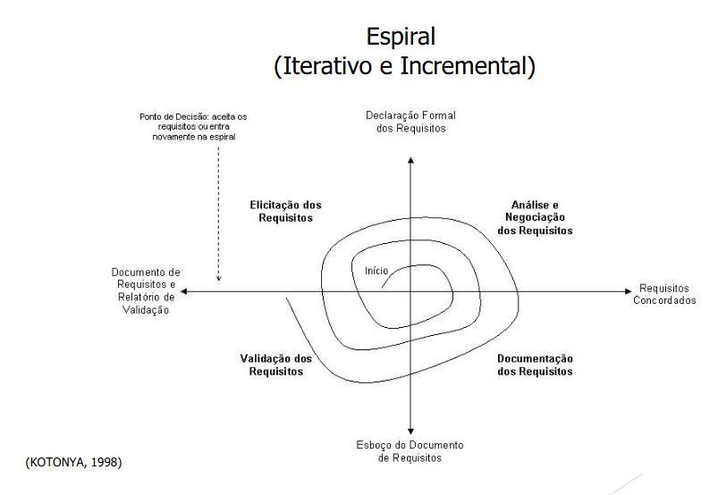

# Requisitos de Software

## O que é um Requisito?

_"Requisitos de um sistema são descrições dos serviços que devem ser fornecidos por esse sistema e as suas restrições operacionais."_  **(SOMMERVILLE, 2007)**

_"Um requisito de um sistema é uma característica do sistema ou a descrição de algo que o sistema é capaz de realizar para atingir seus objetivos."_  **(PFLEEGER, 2004)**

_"Um requisito é algo que o produto dem de fazer ou uma qualidade que este precisa apresentar"_  **(ROBERTSON, 2006)**

Logo, pode-se categorizar um requisito como

1. Uma **condição** ou **necessidade** de um **usuário** para **resolver um problema** ou **alcançar um objetivo**
2. Uma **condição** ou **capacidade** que deve possuir um **sistema** ou componentes de sistemas para satisfazer um **contrato**, **norma**, **especificação** ou outro **documento formal**.
3. Uma **representação** documentada de uma condição, ou capacidade que satisfaça as normas (**_1._**) e (**_2._**)

## Qualidade de Requisitos

A qualidade dos requisitos é um fator fundamental para o sucesso do produto de software a ser construído.

Tanto metodologias tradicionais, quanto as metodologias ágeis prezam pela qualidade dos requisitos

Contudo, o momento da verificação da qualidade dos requisitos pode variar a depender da metodologia que está em vigor para cada projeto.

Existem algumas diretivas que servem de métricas para a medição da qualidade dos requisitos, estas são:

- Ser verificável (testável)
- Ser rastreável
- Ser inteligível
  > As seguintes diretivas são determinadas pela _IEEE - Computer Society_
- Ser correto
- Ser completo
- Ser consistente
- Ser não-ambíguo

### Verificável

Um sistema é verificável se existir algum processo efetivo que demonstre que o software atende aos requisitos documentados.

### Rastreável

Um sistema é rastreável se permite que sua origem seja determinada.

### Correto

Um sistema é correto se os requisitos contém toda a informação necessária, de acordo com as necessidades de cada contexto.

### Completo

Um sistema é completo se a especificação contem todos os requisitos significativos e necessários, tais como:

- funcionalidades
- performance
- restrições
- projetos
- interfaces externas

### Não-ambíguo

Um sistema é não-ambíguo se este possuir uma única interpretação. Esta interpretação deve ser universal e constante entre todos os _stakeholders_ envolvidos diretamente com o projeto.

### Consistente

Um sistema é consistente caso sua especificação (casos de uso, histórias de usuário e especificações suplementares\_ estejam coerentes com as especificações de mais alto nível).

Supletivamente, os requisitos devem apresentar consistência entre si, e em um mesmo nível hierárquico de requisitos, sem que haja conflitos internos.

## O que não é um requisito

### Design

_Mesmo que este demonstre como implementar um requisito:_  
Modelos de design especificam componentes do sistemas e/ou suas interfaces, com seus sub-componentes.

### Verificação

_Mesmo que a verificação demonstre como saber se algum requisito está correto:_  
Modelos de teste especificam casos teste e procedimentos de **testes**.

### Modelagem do banco de dados

_Mesmo que a modelagem demonstre onde e como os requisitos serão armazenados:_  
Modelos de banco de dados definem a estrutura de onde os insumos dos requisitos serão armazenados.

## Abordagens percorridas pelos requisitos

A partir do entendimento do que é um requisito, suas classificações e atributos de qualidade, pode-se começar uma análise a fim de determinar as "**metodologias**" pelos quais os requisitos podem passar

Propõe-se que as metodologias sejam estabelecidas a partir do **contexto organizacional**, das **necessidades dos clientes**, **da equipe de engenharia de software** e, por fim, dos **objetivos** do produto.

> Para clientes mais formais, metodologias **mais** formais

> Para cleitnes menos formais, metodologias **menos** formais

> Para clientes com características híbridas, metodologias **híbridas**

De uma maneira geral, a Engenharia de Requisitos executa as mesmas atividades tanto em metodologias tradicionais, quanto em metodologias ágeis.

Contudo, a filosofia (tradicional ou ágil) que sustenta essa execução, faz com que tais atividades sejam realizadas de maneira singular

## Metodologias da Engenharia de Requisitos

### Modelo Cascata (preditivo)

### Modelo Espiral (iterativo e incremental)

### Processo unificado (_RUP_) (iterativo e incremental)

### Scaled Agile Framework (_S.A.F_) (processo ágil e adaptativo)

#### Portfolio

#### Programa

#### Time

## Atividades da Engenharia de Requisitos

### Elicitação de requisitos

## Notas

### Stakeholders

De maneira ampla, o termo **_stakeholder_** (em português, **parte interessada**) compreende todos os envolvidos humanos em um processo, como empregados ou clientes.
