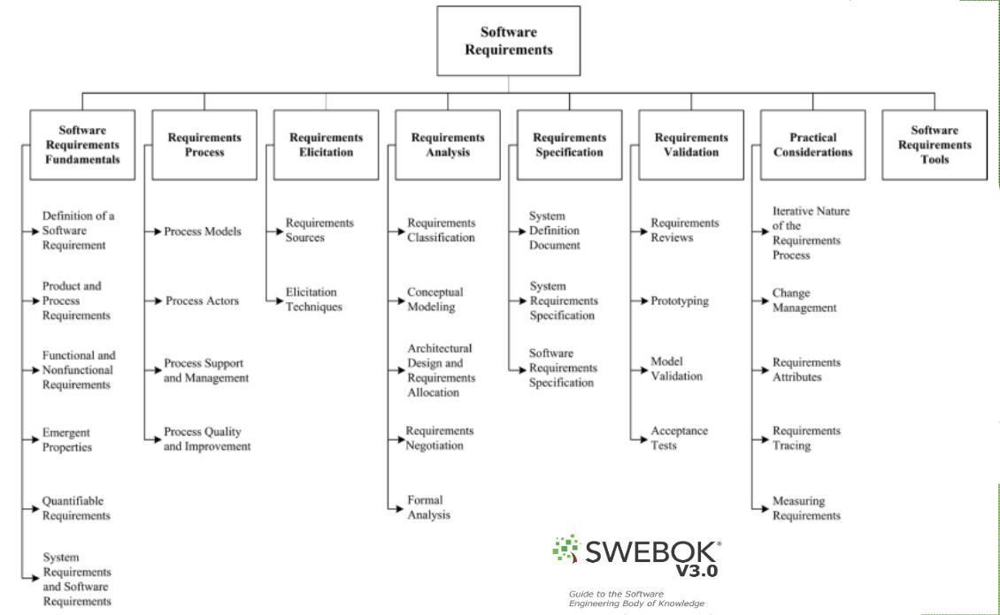
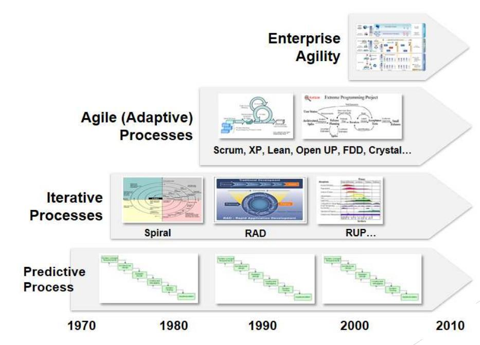
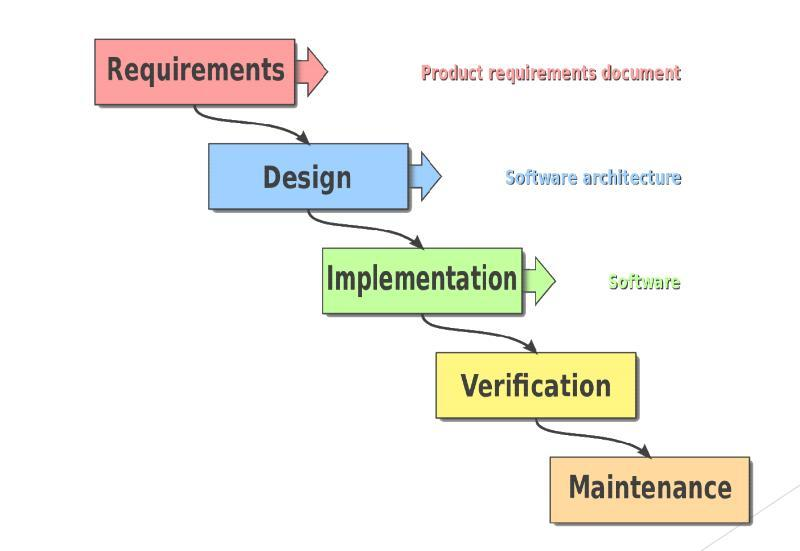
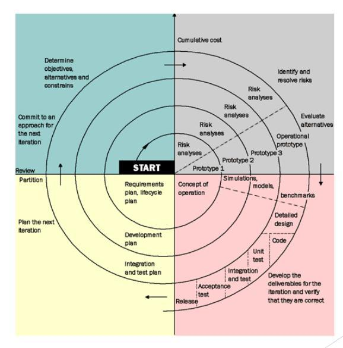
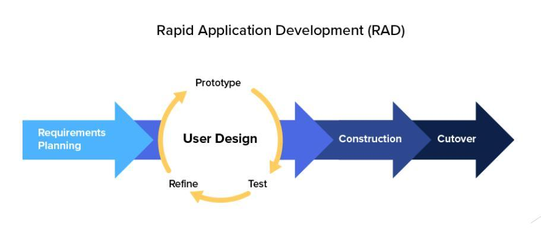
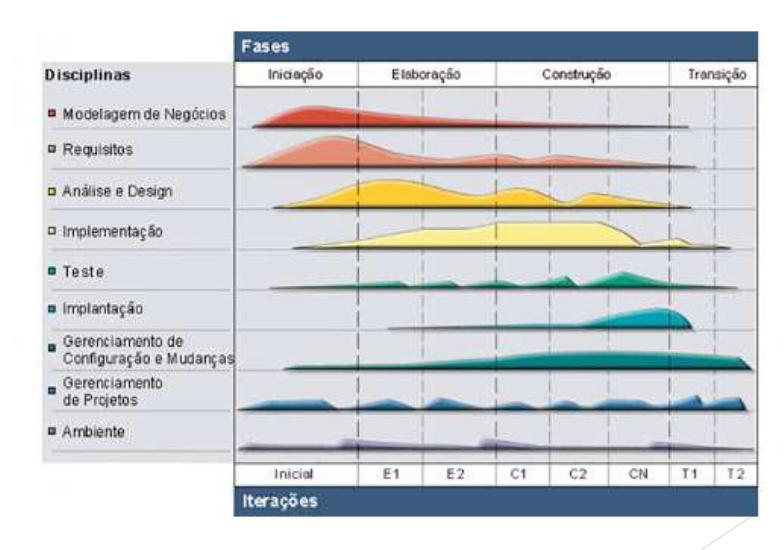
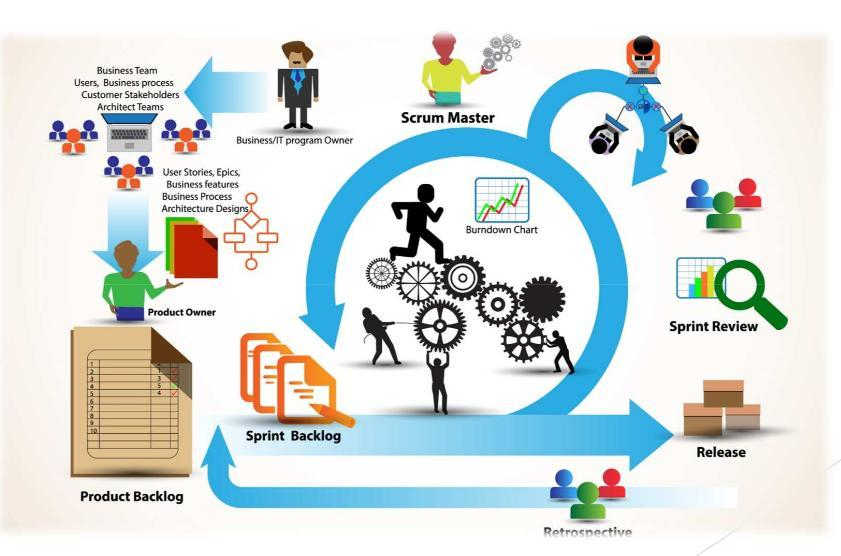
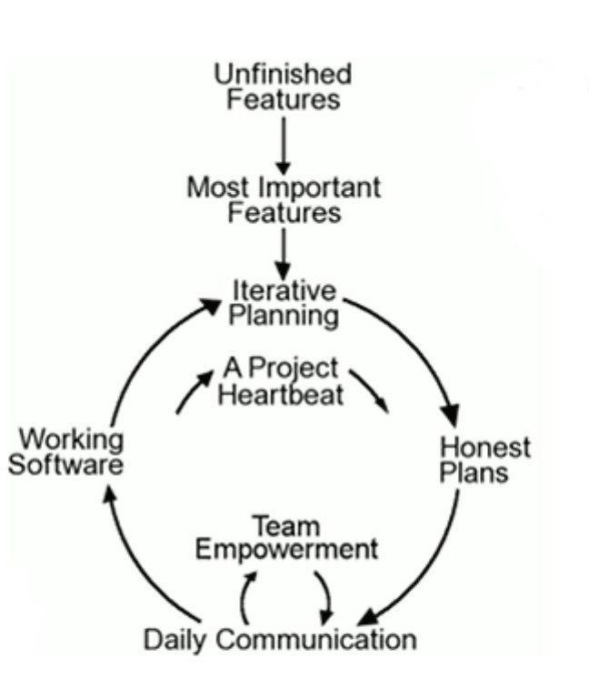
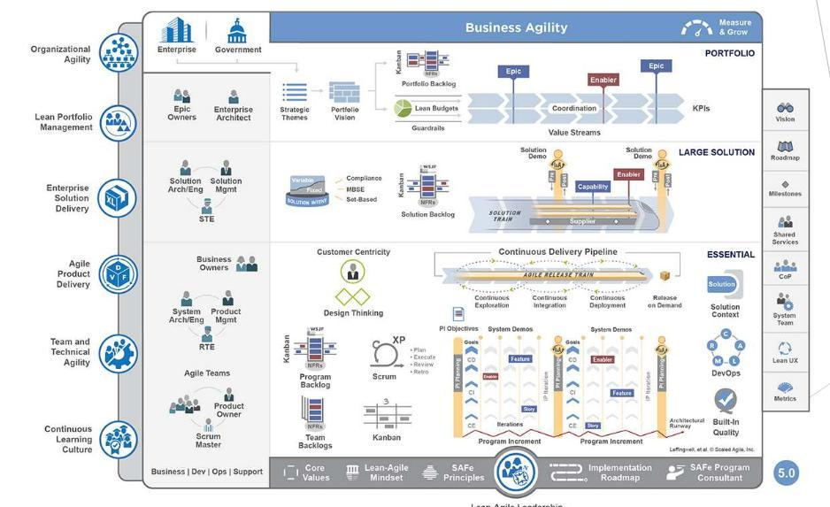
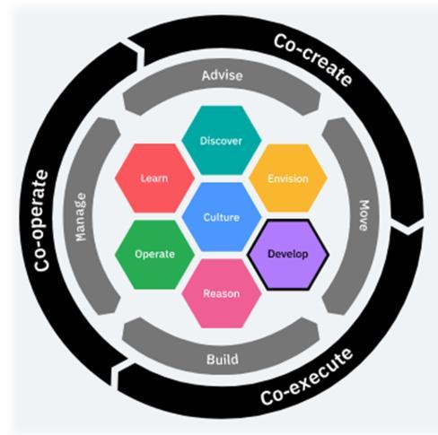

# Requisitos de Software

# SWEBOK V3.0

## O que é?

O **SWEBOK** é o principal marco ára as definições de disciplinas e pilares da Engenharia de Software, assim como o marco para a definição da mesma como uma área de trabalho formal.

## Quais são seus objetivos?

1. Promover uma **visão consistente** pelo mundo inteiro sobre a Engenharia de Software.
2. Especificar o escopo e esclarecer o espaço da **_Engenharia de Software_** em meio, e respeito, à outras àreas; como _Ciência da Computação_, _Gerenciamento de Projetos_, _Engenharia de Computação_ e _Matemática_.
3. Caracterizar os conteúdos da área de Engenharia de Software.
4. Promover um acesso organizado ao **_Corpo de Conhecimento_** da _Engenharia de Software_.
5. Promover **fundação teórica** para a cosntrução de currículos e para o desenvolvimento, licenciamento e desenvolvimento individual.

## Requisitos de software no SWEBOK

O SWEBOK afirma que, para o processo de Engenharia de Requisitos, é necessário ter cuidados e destinar esforço para com a **elicitação**, **análise**, **especificação** e **validação** dos requisitos de software, assim como a gerência destes, durante **_todo o ciclo de vida_** do produto de software.

# Engenharia de Software e Seus Modelos

## Modelos de Processos de Desenvolvimento de Software

- Modelo Sequencial Linear: também chamado de **_Modelo Cascata_** ou _Ciclo de Vida Clássico_
- Paradigma de **Prototipação**
- Modelo **_RAD_** (_Rapid Application Development_)
- Modelos **Evolutivos** de Processo de Software
  - _Modelo Incremental_
  - _Modelo Espiral_
  - _Modelo de Montagem de Componentes_

### Cascata

### Spiral

### RAD

### RUP

### Scrum

### XP

### SAF

### IBM Garage

